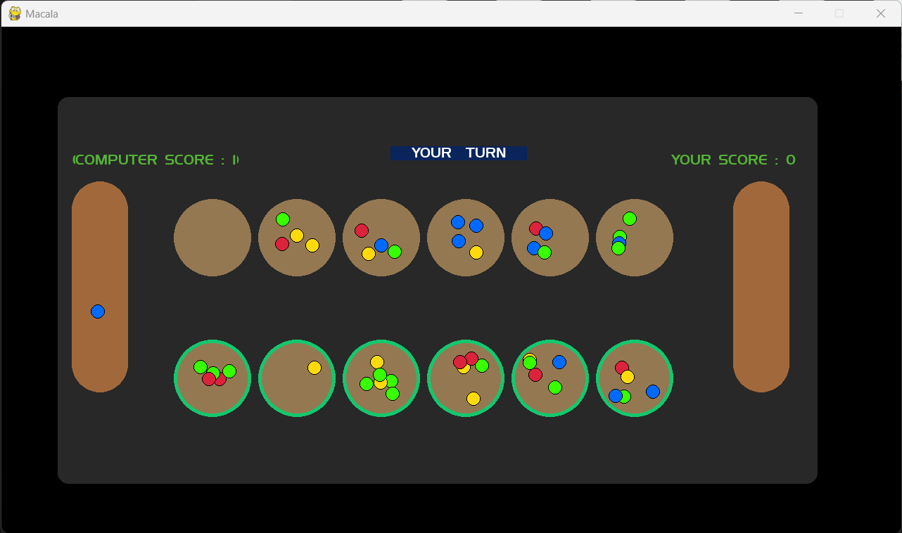

## Mancala 
Mancala is a traditional board game that involves strategy and counting, played across various cultures worldwide.
The origin of Mancala dates back thousands of years, with evidence of its play found in Africa, Asia, and the Middle East.

## Usage 

* You can select any pit to play by only mouse clicking on it
* your turn is displayed in top mid screen
* your score is displayed on right top

## About the AI
The AI used in this game is about a procedure called min-max Alpha beta, we used a diffrent type of heuristics, but in execution only one must be selected, for future features, we will add the option to pick an heuristic manually from the User interface. For now you can feel free to change the code for your purposes

  

# To Do
- [X] player vs AI (heuristic)
- [ ] player vs player 
- [ ] AI (heuristic) vs AI (heuristic)
- [ ] Real time settings change.

## Licence 
Feel free to use fork, this project without any conditions

Made with love by : OMARI Hamza. 